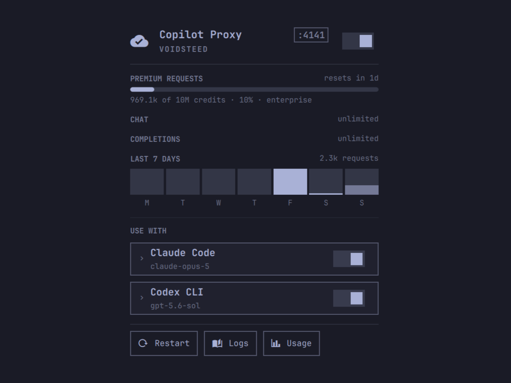

# Copilot Proxy for Omarchy

**Use your GitHub Copilot subscription in Claude Code and Codex CLI.**

Copilot gives you Claude and GPT models through your existing subscription, but only inside an editor. [`copilot-proxy-api`](https://github.com/voidsteed/copilot-proxy-api) exposes them as an Anthropic- and OpenAI-compatible API so your terminal agents can use them too — this plugin puts that whole setup in your Omarchy bar.

Sign in to GitHub, watch what you've spent, pick a model, and point either agent at Copilot — without leaving the desktop or editing a config file by hand.



## What it does

One bar icon and one panel covering the whole lifecycle — the proxy, the login, the quota, and both clients.

- **Service control** — installs a `systemd --user` unit and starts/stops/restarts it from a switch in the panel. The proxy survives shell restarts and comes back after a crash.
- **In-panel GitHub sign-in** — shows the device code with Copy and Open-GitHub buttons, then polls until you approve. No terminal round-trip.
- **Native usage** — every quota bucket Copilot reports, with a reset countdown; unlimited buckets render as a badge rather than an empty bar. Below them, a seven-day chart of what this proxy actually served, which is a different question from what GitHub metered and stays available when the quota call fails. The bar icon lights up at 90%.
- **Per-client configuration** — each client expands to searchable model dropdowns fed by the proxy's live model list, filtered to the models that client can actually drive. Claude Code also gets an effort level (`low`–`max`) and an `ultracode` switch; Codex gets its own reasoning effort (`minimal`–`ultra`). Choices persist to `shell.json` and rewire a wired client immediately.

The panel shows one step at a time: install the service, start it, sign in, then choose a client. Each rung appears only once the one below it is done.

## Requirements

- Omarchy 4.0 or later (the Quickshell-based `omarchy-shell`)
- An active GitHub Copilot subscription
- `copilot-proxy-api` — install with `npm i -g copilot-proxy-api`, or keep a source checkout (see below)
- `jq` and `curl` (both ship with Omarchy)

The plugin needs a `copilot-proxy-api` build that has the `/status` endpoint (added alongside this plugin) for the in-panel sign-in. Everything else works without it; on an older build, sign in with `copilot-proxy-api auth` in a terminal and the panel will pick up the result.

## Install

```bash
omarchy plugin add https://github.com/voidsteed/omarchy-copilot-api.git --enable
```

Then open the panel from the bar and click **Install service**.

Plugins run unsandboxed inside `omarchy-shell`, so they land disabled by default — read the code before enabling. Drop `--enable` to review first, then `omarchy plugin enable voidsteed.copilot-proxy`.

## Usage

Click the bar icon to open the panel. Middle-click starts or stops the proxy without opening it.

Inside the panel:

| Key | Action |
|-----|--------|
| `s` | Start / stop the proxy |
| `r` | Refresh status now |
| `Esc` | Close |
| `Tab` | Switch to the neighbouring panel |

### Choosing a client

Click a client's name to expand its settings; click the switch to wire it. The two are independent, so you can inspect a client's models without wiring it, and change models on a wired one without unwiring first. Models come from the proxy's live list, so the dropdown shows what your plan actually offers.

**Claude Code** merges an `env` block into `~/.claude/settings.json`, leaving your permissions, hooks, and other settings untouched:

```json
{
  "env": {
    "ANTHROPIC_BASE_URL": "http://localhost:4141/",
    "ANTHROPIC_AUTH_TOKEN": "dummy",
    "ANTHROPIC_MODEL": "claude-opus-5",
    "ANTHROPIC_SMALL_FAST_MODEL": "claude-sonnet-5"
  },
  "effort": "max",
  "ultracode": true
}
```

`effort` and `ultracode` are top-level Claude Code settings rather than env vars. Effort set to *default* omits the key entirely, which is not the same as pinning a level.

**Codex CLI** writes a marked region into `~/.codex/config.toml`, so anything you wrote outside it survives:

```toml
# >>> omarchy copilot-proxy >>>
model = "gpt-5.5"
model_provider = "copilot_proxy"
model_reasoning_effort = "high"
# <<< omarchy copilot-proxy <<<

# ... your own settings, untouched ...

# >>> omarchy copilot-proxy provider >>>
[model_providers.copilot_proxy]
name = "GitHub Copilot via copilot-proxy-api"
base_url = "http://localhost:4141/v1"
wire_api = "responses"
# <<< omarchy copilot-proxy provider <<<
```

Two regions, not one, because TOML pulls them in opposite directions: bare keys must come before any `[table]` header or they become members of it, and the provider table must come after them for the same reason. Anything of yours that would collide — a bare `model`, or a `[model_providers.copilot_proxy]` you already had — is commented out with a marker rather than deleted, and restored verbatim when you unwire. The result is parsed before it is written, so a config that would not load is never saved.

Both files are backed up to `<file>.omarchy-copilot-proxy.bak` before the first edit. Agents read config at launch, so restart Claude Code or Codex for a change to take effect.

Both toggles can be on at once — they configure different files and don't conflict.

## Configuration

Settings live in the bar entry in `~/.config/omarchy/shell.json`, editable from Setup > Plugins:

| Key | Default | Meaning |
|-----|---------|---------|
| `port` | `4141` | Port the proxy listens on |
| `service` | `copilot-proxy-api` | Name of the systemd user unit |
| `refreshIntervalSec` | `300` | How often to poll status and quota |
| `claudeModel` | `claude-opus-5` | Written to `ANTHROPIC_MODEL` |
| `claudeSmallModel` | `claude-sonnet-5` | Written to `ANTHROPIC_SMALL_FAST_MODEL` |
| `claudeEffort` | `default` | `effort` in settings.json — `low`, `medium`, `high`, `xhigh`, `max`, or `default` to omit |
| `claudeUltracode` | `false` | `ultracode` in settings.json |
| `codexModel` | `gpt-5.5` | Written as `model` in the Codex config |
| `codexReasoningEffort` | `high` | `minimal`, `low`, `medium`, `high`, `xhigh`, `max`, or `ultra` |
| `hideWhenStopped` | `false` | Hide the bar icon while the proxy is stopped |

The model and effort settings are also editable from the panel, which writes them back here.

Move the widget with `omarchy bar move voidsteed.copilot-proxy --section center`.

## Running from a source checkout

If `copilot-proxy-api` isn't on `PATH`, the helper looks for a checkout in `$COPILOT_PROXY_DIR`, then `~/code`, `~/src`, `~/projects`, `~/dev`, and `~/repos`. It runs `dist/main.mjs` with node if the checkout is built, or `src/main.ts` with bun if it isn't.

For a checkout kept anywhere else, point `COPILOT_PROXY_DIR` at it:

```bash
COPILOT_PROXY_DIR=~/work/copilot-proxy-api omarchy-copilot-proxy install-unit
```

The path is resolved once, at `install-unit` time, and written into the systemd unit — so the variable only needs to be set for that one command, not for every launch. Override the whole command with `COPILOT_PROXY_COMMAND` if you need something more unusual.

## The CLI

Everything the panel does is also a command, useful for scripting or debugging:

```bash
bin/omarchy-copilot-proxy status        # JSON: service, auth, quota, client wiring
bin/omarchy-copilot-proxy install-unit  # write and enable the systemd unit
bin/omarchy-copilot-proxy start|stop|restart|logs
bin/omarchy-copilot-proxy auth          # blocking device-code login
bin/omarchy-copilot-proxy use-claude    # wire Claude Code to the proxy
bin/omarchy-copilot-proxy use-codex     # wire Codex CLI to the proxy
bin/omarchy-copilot-proxy unset-claude | unset-codex
bin/omarchy-copilot-proxy dashboard     # open the usage dashboard
```

Add `--port`, `--service`, `--model`, `--small-model`, `--effort`, `--ultracode` / `--no-ultracode`, or `--reasoning-effort` to any of them.

The panel is also driveable over IPC:

```bash
omarchy-shell copilot-proxy toggle
omarchy-shell copilot-proxy start
omarchy-shell copilot-proxy useClaude
```

## Troubleshooting

**"copilot-proxy-api is not on PATH"** — install it globally, or point `COPILOT_PROXY_DIR` at a checkout.

**Service starts then fails** — check `journalctl --user -u copilot-proxy-api -n 50`, or click **Logs**. The usual cause is another proxy already holding the port; `ss -tlnp | grep 4141` will show it.

**Sign-in button does nothing** — the device flow is hosted by the proxy, so it has to be running first. Start it, then sign in.

**Panel shows stale numbers** — press `r`, or lower `refreshIntervalSec`.

## Security

The plugin runs unsandboxed inside `omarchy-shell`, with your user's permissions. It:

- writes a systemd unit to `~/.config/systemd/user/`
- reads and writes `~/.claude/settings.json` and `~/.codex/config.toml` (backing both up first)
- talks to `localhost` on the configured port only
- never handles your GitHub token — that stays in the proxy's own `~/.local/share/copilot-proxy-api/github_token`, mode 600

The `/status` endpoint it polls is deliberately outside the proxy's API-key gate, but exposes no tokens and no model access. Keep the proxy bound to localhost.

### Treating the proxy as untrusted

Everything the panel draws comes from the proxy over HTTP, and some of it ends up in files your agents load or in a URL your browser opens. The proxy is a separate program on a port, so its output is validated rather than trusted:

- **Model ids** must match `^[A-Za-z0-9][A-Za-z0-9._:/-]{0,127}$` — no quotes, backslashes, whitespace, or newlines. They are checked when offered in the dropdown, when stored, before the helper is called, and again inside the helper; values written to `~/.codex/config.toml` are escaped as TOML strings on top of that. Without this, a model id containing a quote could close its TOML string and append configuration of its own — which the parse check afterwards would not catch, since injected TOML parses fine.
- **The sign-in URL** is opened only if it is exactly GitHub's device-login page (`https://github.com/login/device`), matched on parsed scheme, host, and path. Anything else falls back to the canonical URL, so a `file://` path, a lookalike host, or a redirector carrying the real URL in its query string is never handed to `xdg-open`.
- **Effort levels** are closed sets, and **port** and **service name** are range- and charset-checked before either becomes part of a path or a unit file.

`copilot-proxy-api` is an unofficial, reverse-engineered project that is not affiliated with GitHub. Use it within [GitHub's Acceptable Use Policies](https://docs.github.com/site-policy/acceptable-use-policies/github-acceptable-use-policies) and [Copilot Terms](https://docs.github.com/site-policy/github-terms/github-terms-for-additional-products-and-features#github-copilot).

## Uninstall

```bash
omarchy plugin remove voidsteed.copilot-proxy
systemctl --user disable --now copilot-proxy-api
rm ~/.config/systemd/user/copilot-proxy-api.service
```

Client config written by the plugin is left in place; remove it from the panel first, or restore the `.omarchy-copilot-proxy.bak` files.

## License

MIT
